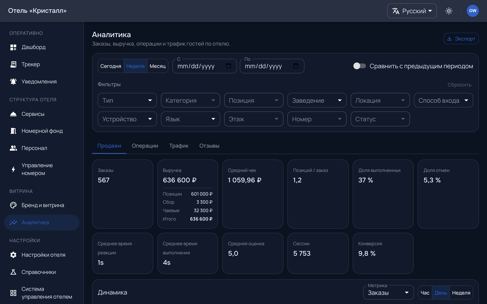

# Аналитика

`/admin/analytics` — что считается и за какой период.

Отвечает на вопросы «сколько заказали», «на какую сумму», «как быстро
обслуживали», «что заказывают чаще». Разрезы — по заведениям, по времени, по
позициям.

Три вещи, без которых числа читаются неверно:

**День считается по часовому поясу отеля.** Не сервера и не браузера. Смена,
переходящая через полночь, разносится по двум дням — так же, как её считает
бухгалтерия отеля.

**Пустой период — это не ноль.** Отсутствие данных показано отдельно от нуля:
«заказов не было» и «данных нет» — разные утверждения, и на графике они
выглядят по-разному.

**Глубина зависит от тарифа.** Расширенная аналитика — отдельный модуль; без
него доступны базовые разрезы.

Выгрузка — на экране. Она берёт **текущий отбор**, а не всё подряд: то, что
видно на экране, и уедет в файл.
