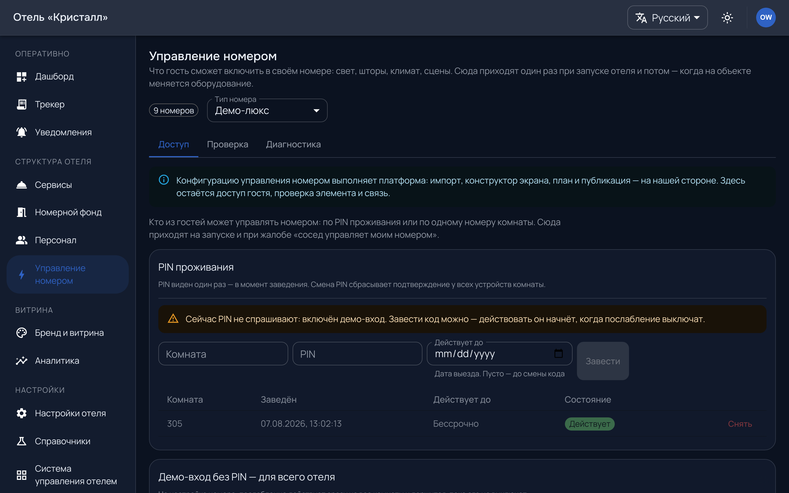

# Управление номером

`/admin/room-control` — свет, шторы, климат в номере. Раздел модульный: без
модуля пункт не показывается в навигации, хотя адрес продолжает открываться по
прямой ссылке.

---

## Что здесь ваше, а что наше

**Наше:** оборудование заводим и настраиваем мы — типы номеров, элементы,
привязка к каналам, уровень плана. Это делается из платформенной консоли вместе
с вашим интегратором.

**Ваше:** видеть состояние связи и понимать, что происходит.

Такое разделение не про доверие: карта устройств и каналов задана при
пусконаладке, ошибка в ней выглядит как «свет не реагирует», и чинится она у
интегратора, а не в панели.

---

## Что показывает экран

Состояние связи с оборудованием: есть она или нет. Подробностей — кодов ответов
оборудования, сырых журналов обмена — здесь нет намеренно: они ничего не
объясняют без карты каналов, зато в разговоре с интегратором становятся
аргументом не в ту сторону. Инженеру эта глубина доступна, и он к ней идёт по
[своей книге](../ops/handbook/connector.md).

**Гость причины не видит вообще** — у него один нейтральный текст.

---

## PIN проживания

Управлять оборудованием может не всякий, кто вошёл в приложение из комнаты:
нужен **PIN проживания**, который называет ресепшен при заселении.

PIN подтверждает не личность, а право распоряжаться номером. У кода есть **срок
— дата выезда**: после неё код не принимается, а уже выданное подтверждение
гаснет.

Новое подтверждение **гасит предыдущие**: заселился следующий гость — прежний
телефон управление теряет.

Есть послабление — **демо-вход**, при котором PIN не спрашивается ни у кого.
Он для показов. Включённый в работающем отеле, он раздаёт управление номером
каждому, кто вошёл в комнату.

---

## Выезд

Кнопка «гость выехал» закрывает гостевые сессии комнаты. Пока PMS не подключён,
это единственный способ сообщить системе о выезде — иначе телефон уехавшего
гостя остаётся с доступом до истечения срока.
