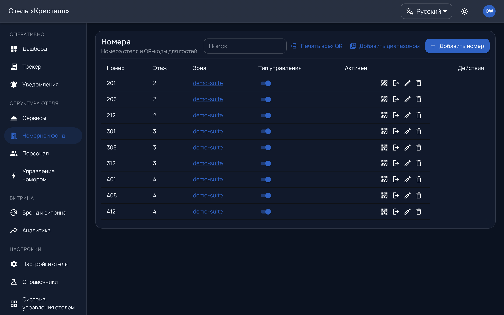
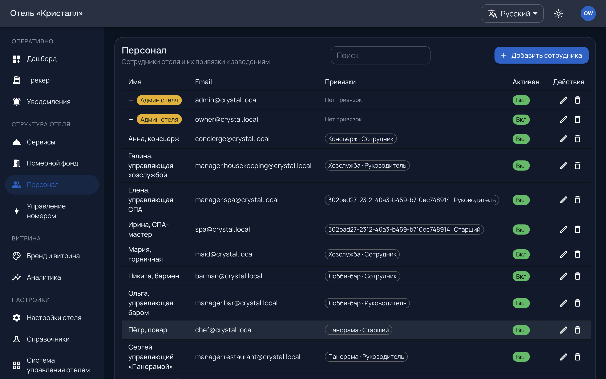

# Номера и персонал

Две опоры, без которых остальное не работает: гостю надо куда войти, а заявке —
к кому попасть.

## Номерной фонд

`/admin/rooms` — комнаты отеля.

Номер комнаты — это то, что гость вводит руками или получает сканом кода со
стены. Комнаты, которой нет в фонде, гость не найдёт, и вход у него не
состоится.

**Печатный код кодирует ссылку вида `/r/:roomNumber`** — например `/r/401`.
Форма ссылки заморожена: коды наклеены в номерах, и смена схемы означает
перепечатку по всему отелю. Перед тиражом проверьте один код на одной комнате
целиком: скан → витрина → номер узнан → заказ оформляется.

Если включено [управление номером](room-control.md), комната относится к **типу
номера** — набору комнат с одинаковым оборудованием. Настройка делается на тип,
а не на комнату.

Число комнат ограничено тарифом.

## Персонал

`/admin/staff` — сотрудники и то, что им доступно.

У сотрудника две вещи, и они независимы:

**Роль** — что можно в панели: администратор ведёт отель целиком, исполнитель
работает на доске, наблюдатель смотрит.

**Точки исполнения** — над чем он работает. Исполнитель без точек видит **пустую
доску**: она собирается по его точкам, а не по отелю. Это первое, что надо
проверить, когда сотрудник говорит «у меня ничего нет».

**Старший** точки получает [эскалацию](work.md#эскалация) по невзятым заявкам.
Точка без старшего — это заявка, о которой отель узнаёт от гостя.

Число сотрудников ограничено тарифом.

---

## Кто заводит администратора

Первого администратора отеля заводит платформа при подключении, и пароль
уходит письмом — **один раз**. Дальше администратор заводит остальных сам.

Если доступ к почте администратора потерян, восстановление идёт через нас:
отправлять письмо на потерянный ящик бессмысленно, поэтому там отдельная
процедура смены адреса.

Дальше: [работа смены](work.md).
