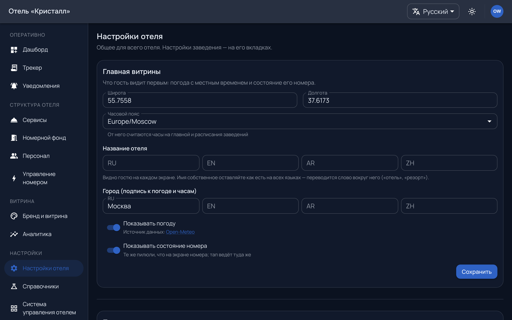
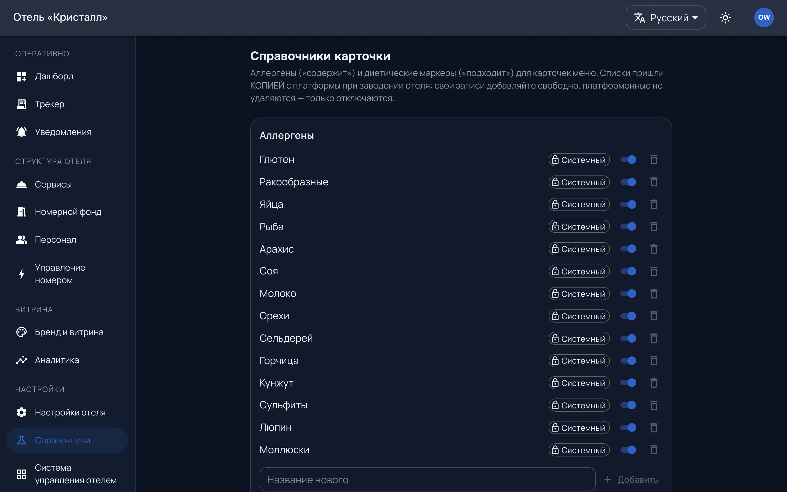

# Настройки и справочники

## Настройки отеля

`/admin/settings` — валюта, часовой пояс, языки, правила заказа.

Два поля меняют поведение сильнее остальных:

**Часовой пояс** — по нему считаются смена, просрочка и аналитика. Ставится
один раз, при подключении.

**Языки.** Первый — язык по умолчанию: на нём гость увидит то, что не
переведено. Добавив язык, вы добавили работы каталогу: непереведённая позиция
не прячется, а показывается на языке по умолчанию.

## Справочники

`/admin/dictionaries` — статусы заказов, причины отмены и прочие списки,
из которых собирается работа.

Часть справочников приходит **от платформы** как образец. Правило то же, что у
бейджей: пока вы не трогали запись, она следует за нашим образцом; тронули —
отвязывается и живёт по-вашему. Тихо перетереть вашу правку мы не можем.

Статусы — не косметика: по ним устроен поток на [доске](work.md), и терминальный
статус закрывает заявку. Заводя свой статус, укажите его место в потоке.

## Модули, которых пока нет

Разделы «Система управления отелем», «Оплата», «Мобильный ключ» показывают
экран ожидания: возможность предусмотрена, интеграции нет.

Это честный ответ, а не заглушка ради вида. Пока модуля нет:

* **заселение и выезд не приезжают** — выезд отмечается [кнопкой](room-control.md#выезд),
  у PIN есть срок;
* **заказ оформляется без списания денег**;
* **мобильного ключа нет**.

Включение этих модулей — разговор с платформой, из панели они не включаются.
