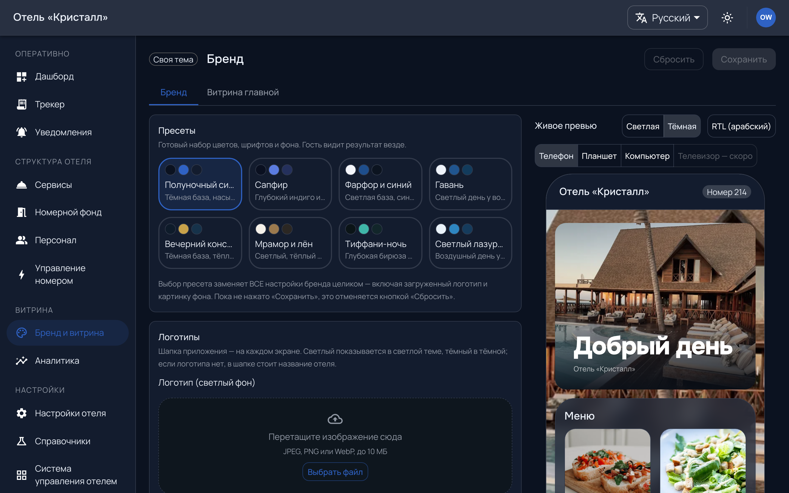
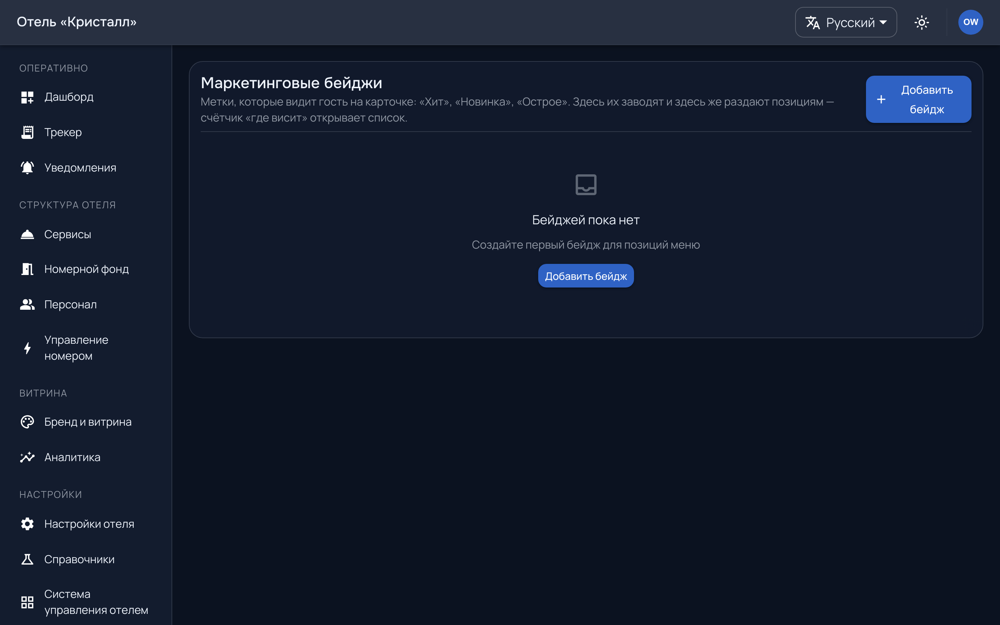

# Витрина и бренд

Как отель выглядит гостю и чем выделяет отдельные предложения.

## Бренд

`/admin/brand` — цвета, логотип, фотографии, оформление витрины.

Отель получает готовую тему при подключении и правит её здесь. Менять можно
смело: витрина гостя перерисовывается целиком, ничего не «съезжает» — палитра
задана токенами, а не отдельными цветами в разных местах.

**У каждого раздела подписано, где результат увидит гость** — читайте эту
строку, она отвечает на вопрос «куда это попадёт» лучше, чем название поля.
Разделы идут в порядке того, что гость видит первым: шапка, первый кадр, потом
цвет и текст.

Две вещи, которые названиями полей не угадываются:

**Отдельного поля «обложка» нет.** Обложкой первого экрана становится **фон**,
если выбрать вид «изображение». При любом другом виде (цвет, градиент,
абстракция) обложки у отеля нет вовсе, и первый кадр берёт фирменный градиент.
Тот же фон при этом виден и на экране входа, и в каталоге заведения.

**Пресет заменяет всё целиком** — включая загруженный логотип и картинку фона.
Пока не нажато «Сохранить», это отменяется кнопкой «Сбросить»; после — нет.
Поэтому пресет выбирают до ручных правок, а не после.

Живой показ справа рисует первый экран гостя целиком и **вашими** блюдами с
их настоящими фотографиями; образцы он показывает только пока каталог пуст.

Фотографии — самое заметное. Пустая карточка заведения выглядит как неработающий
раздел, даже если внутри полное меню.

### Своё оформление

Рядом с заголовком экрана бренда стоит метка: **следует за пресетом
платформы**, **своё оформление** или **своя тема**.

Это не оценка и не предложение что-то починить. Перекрасить витрину под свой
бренд — ровно то, чего от отеля ждут. Метка отвечает на другой вопрос: пока
оформление своё, наши правки библиотеки до него **не доезжают**. Знать это
лучше заранее, чем удивляться, что «платформа обновила тему, а у нас не
поменялось».

«Своя тема» означает, что происхождения у неё нет вовсе — её собрали с нуля
или она пришла из времён, когда происхождение не записывалось.

---

## Маркетинг

`/admin/marketing` — бейджи и подборки: «новинка», «хит», «по акции».

Бейдж — способ выделить позицию, не переписывая каталог. Часть бейджей может
прийти **от платформы**: мы публикуем библиотечные бейджи по всем отелям.

Важное следствие: **свою правку нашего бейджа мы не перетираем.** Переименовали
у себя — при следующей публикации отель будет пропущен, а не возвращён к нашему
виду. Расхождение видно платформе, и вернуться к образцу можно, но только явным
действием.

Раздел модульный, и ведёт себя это так: **без модуля пункт исчезает из
навигации, но адрес продолжает работать**. Прямая ссылка из закладок или из
переписки открывает экран, а не ломается молча — это сделано намеренно.

Не путайте с разделами «Система управления отелем», «Оплата» и «Мобильный
ключ»: там наоборот — пункт есть, а за ним экран ожидания, потому что самой
возможности пока не существует (см. [настройки](settings.md#модули-которых-пока-нет)).
