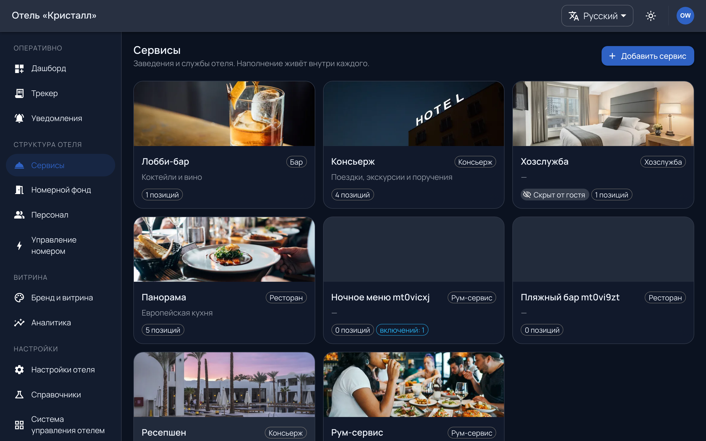

# Структура: сервисы и каталог

`/admin/services` — всё, что гость видит как отдельные места, и всё, что он
может там заказать.

---

## Заведение: витринная сторона

Заведение — то, что гость видит отдельным местом: ресторан «Панорама», лобби-
бар, спа, консьерж, рум-сервис. У него свои часы, своё меню, своя коммерция.

Часы работы — не украшение: закрытое заведение гость видит закрытым, и позиции
в нём не заказываются. Это избавляет от заказов, которые некому исполнить в три
часа ночи.

## Точка исполнения: рабочая сторона

Точка исполнения — кто работает. Заявка попадает **на точку**, и на [доске](work.md)
сотрудник видит свою точку, а не заведение.

Одно заведение может исполняться одной точкой — но это разные понятия, и путать
их дорого:

> **Заведение без точки исполнения — заказ, который не приходит никому.**
> Гость оформил, деньги посчитаны, статус «новый», и он там останется. Это
> самая частая дыра нового отеля, и пульт про неё говорит отдельной строкой.

---

## Каталог: четыре типа предложения

Один движок, четыре формы. Различается тело позиции, а не система:

| Тип | Что это | Пример |
|---|---|---|
| Товар | блюдо или предмет | «Негрони», халат |
| Заявка-услуга | просьба с полями | уборка, вызов такси |
| Слот | бронь времени | столик, массаж |
| Информация | страница без заказа | правила спа, как добраться |

Информационная страница — тоже позиция каталога, и это сделано намеренно: иначе
«как добраться» жило бы отдельной сущностью со своим редактором и своим
переводом.

Позиции собираются в категории, категории — в заведение. Редактор позиции
открывается из рабочего пространства заведения; отдельного «меню» в панели
больше нет — оно вело туда же.

---

## Что стоит проверить после наполнения

1. У каждого заведения назначена точка исполнения.
2. Часы работы заполнены — иначе заведение считается открытым всегда.
3. У точки задан порог просрочки или он унаследован от типа (см. [работу
   смены](work.md)).
4. Хотя бы одна позиция доступна: пустое заведение гость видит пустым.
5. Переводы — на всех языках, включённых в [настройках](settings.md). Позиция
   без перевода показывается гостю на языке по умолчанию, а не прячется.

---

## Своя коммерция у заведения

Сбор, чаевые, порог бесплатной доставки и округление у заведения могут
отличаться от отельных. Пустое значение означает «как у отеля», и меняется оно
вместе с отельным.

На экране коммерции есть **список тех, у кого своё** — с обеими величинами
рядом. До него ответ на вопрос «почему сбор не везде десять процентов»
собирался обходом карточек по одной и собирался неверно: заглянув в шесть
заведений из девяти, человек уходил с уверенностью, что везде одинаково. Это
деньги, и ошибка здесь приходит счётом гостя.

В списке два разных состояния, и второе важнее, чем кажется:

| Метка | Что значит |
|---|---|
| своё | значение отличается от отельного |
| закреплено | значение задано руками и **совпадает** с отельным |

«Закреплено» выглядит как «всё в порядке» и им не является: такое заведение за
отелем больше **не идёт**. Поднимете сбор отеля — у него останется прежний.

Возврат ставит наследование, а не копию отельного числа. Скопированное число —
тот же оверрайд под другим именем: список очистился бы, а наследование не
вернулось.

---

## Лимиты

Число заведений ограничено тарифом. Превышение видно на пульте отдельной
строкой; сменить тариф из панели нельзя — это разговор с платформой.

Дальше: [номера и персонал](rooms-staff.md).
