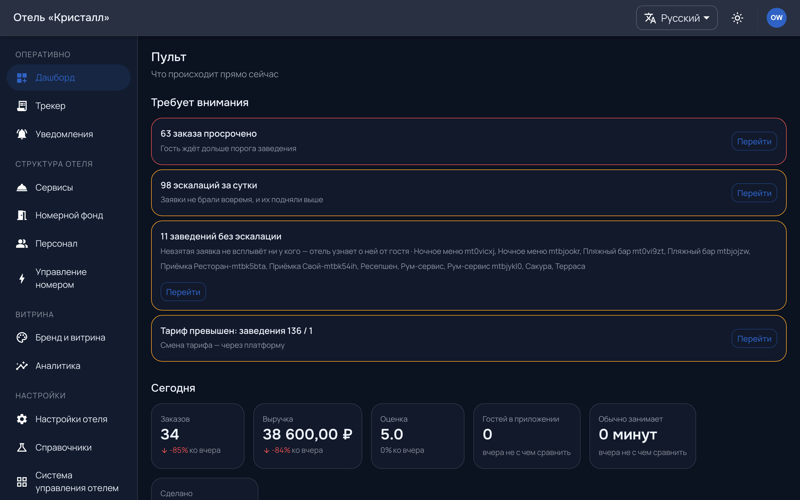
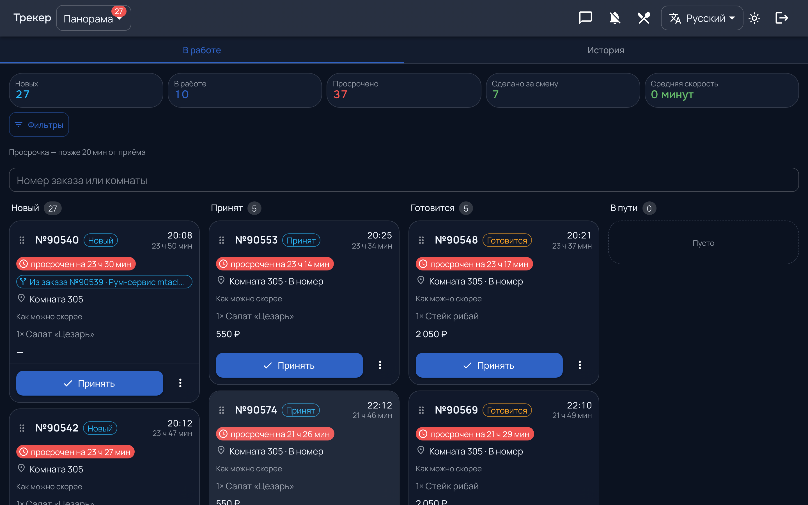
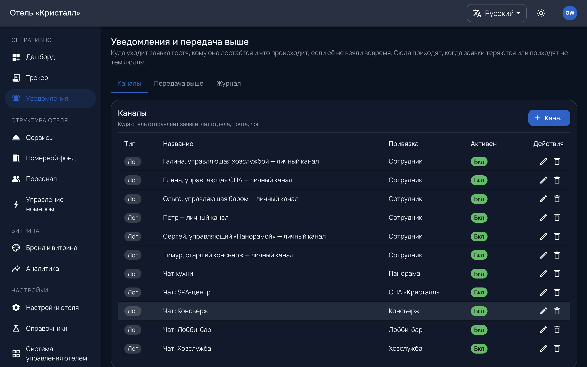

# Работа смены

Три экрана оперативного блока: пульт, доска, уведомления. Пульт отвечает «всё
ли в порядке», доска — «что делать сейчас», уведомления — «о чём сообщить».

---

## Пульт

`/admin/dashboard` — первый экран. Наверху блок «требует внимания», и он
устроен так, чтобы **пустота была хорошей новостью**.

Туда попадает то, что уже мешает работать: просроченные заказы, заведения без
эскалации, превышенный тариф. Каждая строка ведёт туда, где это чинится.

Ниже — числа за сегодня со сравнением со вчера. Смена считается по
календарному дню **в часовом поясе отеля**, а не сервера: это важно для отелей
не в вашем поясе и для смен, переходящих через полночь.

---

## Доска

`/tracker` — рабочее место исполнителя. Адрес **не** под корнем панели:
доска открывается сама по себе, чтобы исполнителю не надо было ходить через
административный раздел.

Заявки своей точки по колонкам; перетаскивание двигает вперёд по потоку.
Обновляется живо — вручную страницу перезагружать не нужно.

**Доска собирается по точкам сотрудника.** Пустая доска почти всегда означает,
что точки не назначены (см. [персонал](rooms-staff.md#персонал)), а не что
заявок нет.

> **Если доска стала «тормозить» и терять заявки** — сначала посмотрите, сколько
> на ней активных заказов. Доска рисует все, старые первыми, и несколько сотен
> незакрытых заявок с прошлой недели выглядят как поломка. Закрывать заявки
> в терминальный статус — это не бюрократия, это условие работы доски.

---

## Просрочка

Заявка, не **принятая** дольше порога, считается просроченной. Именно
принятая: отсчёт останавливается, когда её взяли в работу, а не когда закрыли.

Порог задаёт точка исполнения. Пустое значение означает «взять умолчание типа»,
и на экране видно, **откуда порог взялся** — свой он или унаследованный. Это
избавляет от вопроса «почему у похожих точек разное поведение».

## Эскалация

Просроченная заявка поднимается старшему точки. Эскалация гаснет сама, как
только заявку приняли — отдельно «отменять» её не нужно.

**Точка без старшего эскалацию не производит.** Формально всё настроено, а
невзятая заявка не всплывает ни у кого; отель узнаёт о ней от гостя. Пульт
называет такие заведения поимённо.

---

## Уведомления

`/admin/notifications` — куда и о чём сообщать.

Настраивается, какие события кому уходят. Здесь же видно, что уже отправлено —
это первое место, куда идти с вопросом «а сообщение вообще ушло».

Чего сегодня **нет**, и это стоит знать до обещаний гостю: уведомление доходит,
пока приложение открыто или свёрнуто. **Закрытому приложению push не
приходит** — для этого нужен отдельный механизм, и его пока нет.
