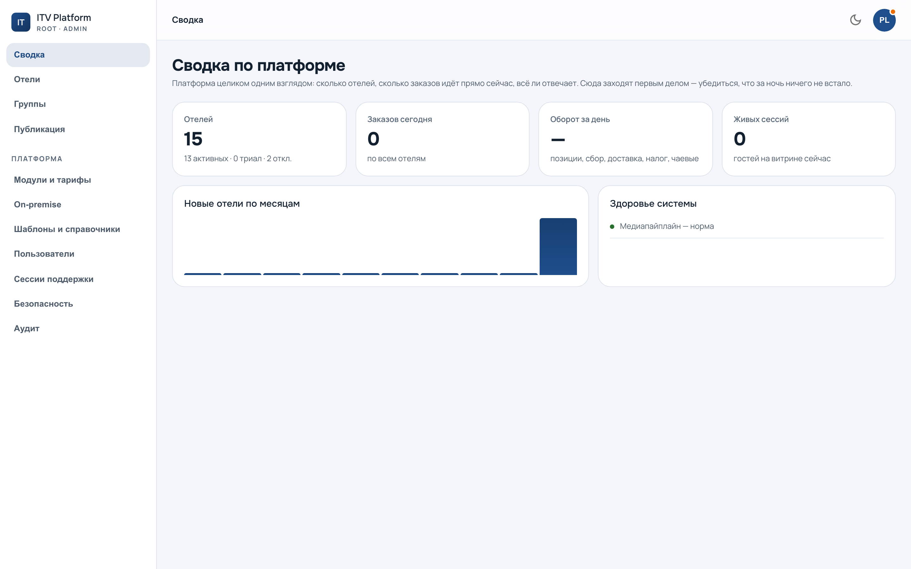

# Консоль платформы

Книга для нашей команды: тех, кто ведёт отели, а не работает в отеле. Всё, что
здесь описано, отелю не видно и не доступно.



Термины — в [глоссарии](../glossary.md), общем для всех трёх книг. Как система
устроена и как её обслуживать — в [инженерной книге](../ops/handbook/README.md).

---

## Где это

Консоль живёт на `/admin` **корневого** адреса платформы. С адреса отеля её
нет: попытка войти оттуда отвечает `platform_wrong_host`, и это не настройка, а
устройство системы — мастер-ключ не должен быть доступен по адресу клиента.

Разделы адресуются в строке браузера: `/admin?section=fleet`. Ссылку на раздел
можно послать коллеге, и она откроется там же.

Слева — два блока. Верхний про **отели** (сводка, флот, группы, публикация),
нижний про **саму платформу** (модули, узлы, шаблоны, команда, сессии
поддержки, безопасность, аудит). Разделение не косметическое: в верхнем вы
работаете за отель, в нижнем — за нас.

---

## Оглавление

| Глава | О чём |
|---|---|
| [Флот и карточка отеля](fleet.md) | завести, найти, настроить тариф и модули, отключить |
| [Группы](groups.md) | разрезы флота: список и правило |
| [Публикация](publication.md) | одно и то же многим отелям, с отчётом по каждому |
| [Эталоны и расхождения](standards.md) | наш образец и то, что отель правил у себя |
| [Команда, роли и область](team.md) | кто что может и над кем |
| [Вход в отель под аудитом](support.md) | как помогать, не подменяя собой отель |
| [Узлы и управление номером](nodes.md) | коннекторы, ключи, конфигурация оборудования |
| [Безопасность и журнал](security.md) | второй фактор, сети, что записано |

---

## Три правила консоли

**Отель — не наш.** Мы обслуживаем, а не владеем. Отсюда всё остальное:
локальная правка отеля не перетирается публикацией, вход под его учёткой виден
ему в журнале, а необратимое требует подтверждения именем.

**Область режет выдачу, а не только кнопки.** Оператор с областью не видит
чужие отели в списках вовсе — не «видит и не может». Поэтому «у меня их нет» и
«их не существует» на экране выглядят одинаково, и это осознанный выбор.

**Отказ и ошибка — разные новости.** Отель не принял публикацию (нет модуля, не
тот тариф, лимит) — идти к отелю. Упало у нас — идти к нам. Экраны их не
смешивают, и в отчётах они считаются порознь.

---

## Снимки

Все снимки в этой книге сняты прогоном и пересоздаются одной командой:

```bash
docker compose up -d
cd e2e && npx playwright test --config=shots/config.ts handbook-shots
```

Руками сюда ничего не кладётся. Экран, вставленный картинкой один раз, врёт
через месяц, и заметить это некому — а пересъёмка показывает расхождение сразу.

**Прогон ничего не создаёт на стенде** — снимает то, что уже посеяно. Отсюда
следствие, которое лучше назвать, чем прятать: разделы, где на демо-стенде
данных нет, сняты **пустыми** — сегодня это группы и публикация. Снимок
показывает, где раздел находится и что он о себе говорит, а не как он выглядит
заполненным.

Наполнять стенд ради красивой картинки в книге я не стал намеренно: стенд
общий, по нему идут показы и чужие проверки, и группа «для снимка» осталась бы
там навсегда.

Два сторожа следят за этим разделом и оба заведены после настоящей ошибки:
снимок, на который ссылается книга, обязан существовать, и **два имени не могут
указывать на один файл**. Второе поймало съёмку карточки отеля, которая кликала
«первую кнопку списка» — ею оказался фильтр, и в книгу лёг второй экземпляр
экрана флота под именем карточки. Ссылка работала, картинка была, подпись
врала.
