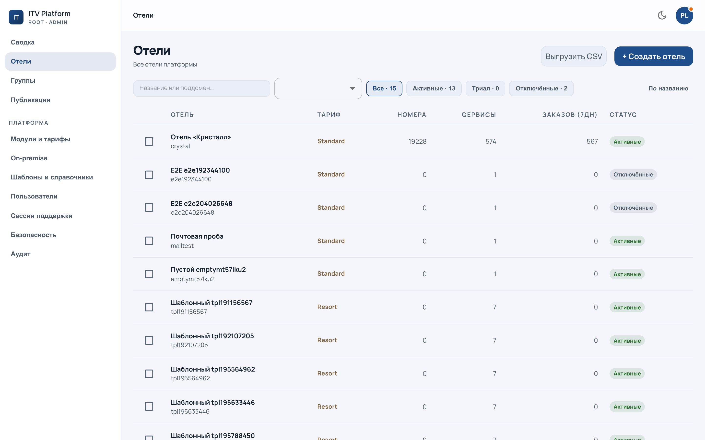
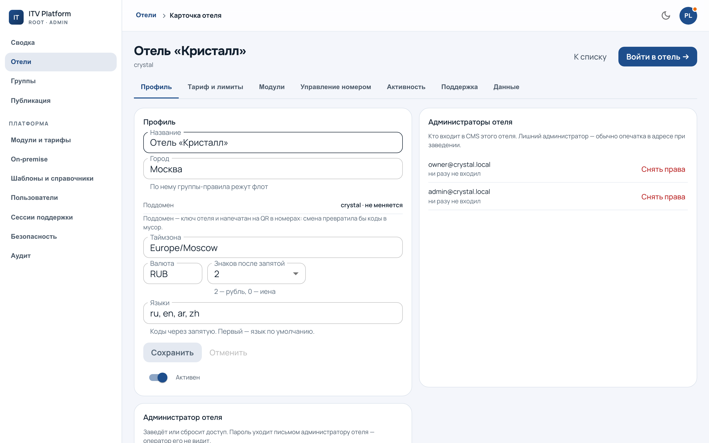
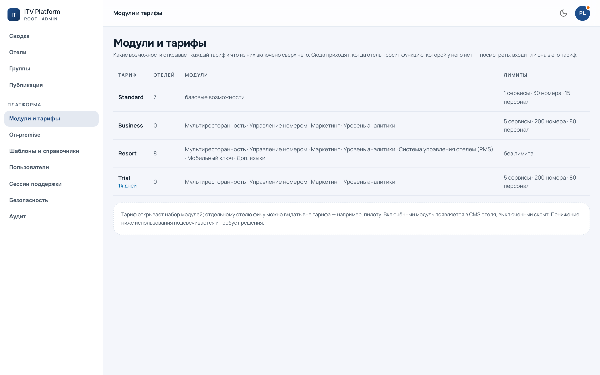

# Флот и карточка отеля

`/admin?section=fleet` — все отели платформы одним списком.

Список — рабочее место, а не витрина: отсюда заводят отель, ищут его по
названию или поддомену, отбирают по состоянию и делают массовые действия над
отмеченными. Что именно делает каждая кнопка, написано на ней; здесь — что
стоит знать до нажатия.

---

## Завести отель

Кнопка заведения — над списком. Нужны поддомен, название, почта администратора;
остальное имеет разумные умолчания и правится потом.

Три вещи, которые стоит знать заранее:

**Поддомен не меняется просто так.** Он адресует отель, попадает в печатные
QR-коды и в сертификат. Смена поддомена — это перепечатка кодов по всему отелю.

**Пароль администратора уходит письмом и показывается один раз.** В интерфейсе
его потом не посмотреть — он и не хранится в открытом виде. Если почта отеля
недоступна, заведение **честно откажет** и не создаст полуотель: это отказ, а
не поломка, и лечится он настройкой почты, а не повтором.

**Заведение — одна транзакция.** Занятый поддомен даёт отказ, а не наполовину
созданный отель. Проверено исполнением: при недоступной почте в базе не
остаётся ничего.

Новый поддомен на нашем стенде требует ещё одного шага **вне консоли** —
сертификата. Это [инженерная работа](../ops/handbook/onboarding.md#2-сертификат-на-новый-поддомен),
и без неё отель откроется только по HTTP.

---

## Карточка отеля

Строка списка открывает карточку. Она разбита на вкладки, и каждая отвечает на
свой вопрос.

| Вкладка | Вопрос, на который отвечает |
|---|---|
| Профиль | как отель называется, где он, на каких языках |
| Модули | что у отеля включено и почему |
| Тариф | за что он платит и какие у него лимиты |
| Управление номером | типы номеров, конфигурация, уровень плана |
| Активность | что в отеле происходит прямо сейчас |
| Поддержка | наши входы в этот отель |
| Данные | отключение и удаление |

Хлебная крошка возвращает во флот и **сбрасывает фильтры**: они относились к
прежнему списку, и в новом означали бы другое.

---

## Тариф и модули: две разные вещи

Здесь чаще всего путаются, поэтому подробно.

**Тариф** задаёт, что отелю *положено*: набор модулей и лимиты (заведения,
номера, сотрудники). **Модуль** — конкретная возможность. Поверх тарифа живёт
**намерение отеля**: выключенный руками модуль не зажигается новым тарифом.

Правило простое и сформулировано в пользу человека: **раз модуль погасили
руками, тариф не включает его за спиной.** Обратное — включённый сверх тарифа —
это точечное исключение, и при смене тарифа оно гаснет.

**Гаснущие модули показываются поимённо до нажатия.** Это единственный момент,
когда их видно: после смены тарифа отель просто обнаружит пропажу, и объяснять
придётся задним числом. Смотрите этот список, а не закрывайте его.

Раздел `/admin?section=modules` показывает ту же картину по всему флоту: где
какой модуль включён и каким тарифом покрыт.

---

## Отключение и удаление — разные операции

**Отключение** — обратимо. Отель перестаёт открываться у гостя, данные целы,
включается тем же переключателем. Так поступают с должниками и с отелями на
паузе.

**Удаление** — необратимо и требует **ввода поддомена руками**. Подтверждение
именем стоит здесь не для торжественности: кнопка «да» нажимается рефлекторно,
а поддомен приходится прочитать и напечатать. Вместе с отелем уходят его
заказы, гости, каталог и журнал.

Удалять живой отель ради «почистить» не нужно: для этого есть отключение.

---

## Массовые действия

Отметив несколько строк, можно включить или отключить их разом. Панель массовых
действий показывает, **к скольким отелям применится**, до нажатия.

Если у вас область (см. [команду и роли](team.md)), действие идёт **пересечением
области и отбора**, и отели вне области в счёт не попадают. Их количество
показывается отдельной строкой — чтобы «выбрал 40, применилось 12» не выглядело
ошибкой.

Дальше: [группы](groups.md) — если одни и те же отели отбираются регулярно.
