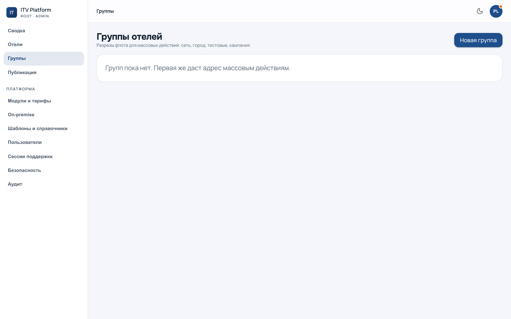

# Группы

`/admin?section=groups` — разрезы флота, которыми потом адресуют массовые
действия и публикацию.

Группа отвечает на вопрос «эти отели вместе — почему?». Вид группы (сеть,
бренд, город, тестовые, участники акции, своя) — это и есть ответ; он ни на что
не влияет технически, но избавляет от групп с названиями вроде «новая-2».

---

## Два вида состава, и разница между ними принципиальна

**Список** — отели сложены руками. Видно, кто и когда добавил каждый. Состав
меняется только человеком.

**Правило** — условие вроде «город Москва». Состав **вычисляется в момент
действия**, а не запоминается при создании: отель, заведённый вчера, попадает в
такую группу сам, а переехавший — выпадает.

Отсюда следствие, которое стоит держать в голове: **у правила нет «состава на
вчера»**. Если нужно зафиксировать, к кому применилось, смотрите не группу, а
отчёт публикации — он перечисляет отели поимённо и не меняется задним числом.

Состав правила руками не правится. Кнопки добавления там нет намеренно: группа,
у которой есть и условие, и ручные исключения, перестаёт отвечать на вопрос
«почему они вместе».

---

## Что можно и чего нельзя

* Отель состоит **в нескольких группах сразу** — сеть, город и акция это разные
  разрезы одного отеля.
* **Вложенности нет.** Группа внутри группы выглядит удобной ровно до первого
  вопроса «а бренд входит в сеть или сеть в бренд».
* Группы заводим **мы**. Отель о них не знает и своих не имеет.

---

## Зачем они нужны

Две вещи адресуются группой, и обе разобраны отдельно:

* [публикация](publication.md) — «этот бейдж всем отелям сети»;
* область платформенной роли (см. [команду](team.md)) — «этот оператор ведёт
  только эту сеть».

Второе — причина, по которой к составу группы стоит относиться серьёзнее, чем к
удобному фильтру: **группой режется доступ**. Добавив отель в группу, вы
показываете его всем, у кого эта группа в области.

---

## Отель, вышедший из группы посреди работы

Публикация уже идёт, а отель из группы убрали. Состав для запущенной работы
**зафиксирован в момент запуска** — она доделает то, что начала, и отчитается по
тем отелям, которые были в списке при старте.

Это выбор в пользу предсказуемости: работа, состав которой меняется на ходу,
не имеет отчёта, которому можно верить.

Дальше: [публикация](publication.md).
