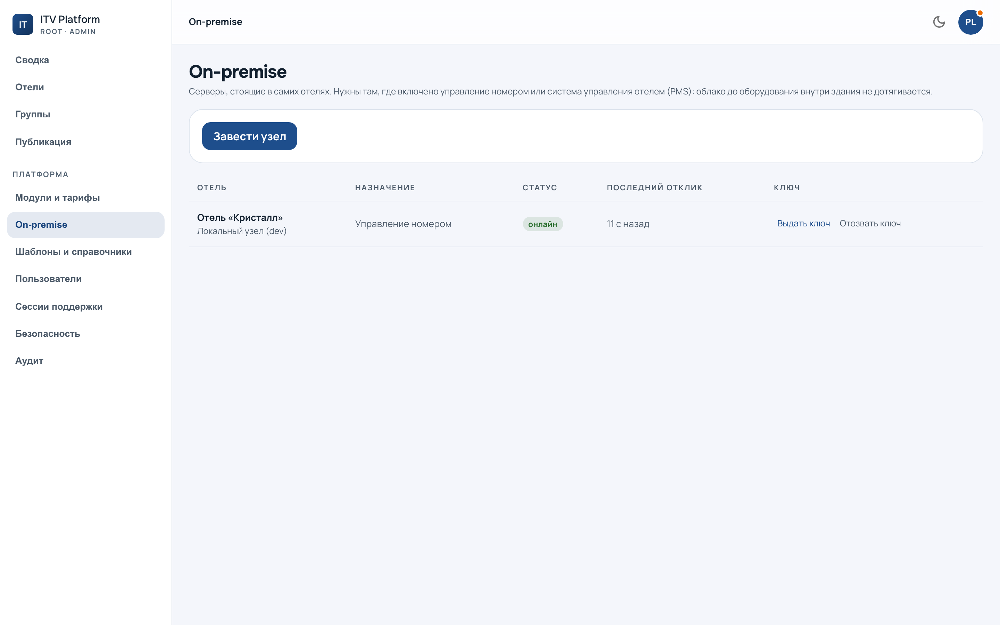

# Узлы и управление номером

`/admin?section=nodes` — коннекторы всех отелей: где стоят, живы ли, когда были
на связи в последний раз.

Как коннектор устроен и как его ставят на объекте — в [инженерной
книге](../ops/handbook/connector.md). Здесь — то, что делается из консоли.

---

## Ключ показывается один раз

Заводя узел, вы получаете ключ. **В базе лежит только его хэш** — посмотреть
ключ позже нельзя, можно лишь перевыпустить.

Перевыпуск нужен чаще, чем кажется:

* ключ потерян;
* сервер отеля переустановили;
* базу пересоздали — **узел исчез вместе с ней**, и коннектор на объекте с этого
  момента стучится с ключом, которого больше нет.

Последний случай — самая частая причина «управление номером недоступно» на
стенде. Признак со стороны объекта: коннектор в петле перезапусков с ошибкой
про ключ.

Ключ **не пишется в конфигурацию** коннектора: конфигурация попадает в
резервные копии и в логи развёртывания, а ключ не должен.

---

## Что показывает список

По каждому узлу — отель, назначение, состояние и давность последней отметки.
Узел отмечается раз в минуту, поэтому «видели минуту назад» это норма, а
«видели три часа назад» — нет.

Отключение узла — не отключение отеля: гость просто не увидит экран номера.

---

## Конфигурация оборудования

Настройка типов номеров живёт **в карточке отеля**, на вкладке управления
номером, а не здесь: она про конкретный отель, а не про парк коннекторов.

Два правила оттуда стоит знать:

**Настраивается тип номера, а не комната.** Комнаты наследуют. Покомнатная
настройка — это сто расхождений там, где должно быть одно решение.

**Гость видит только опубликованную конфигурацию.** Черновик правится сколько
угодно и никому не показывается, пока его не опубликовали.

Уровень плана (плашками, один кадр, два кадра) задаём **мы**, а не отель. Гость
про уровни не знает вовсе — он видит свою комнату.

---

## Диагностика: три звена порознь

Связь показывается **тремя отдельными признаками**, а не одним «недоступно»:
коннектор, endpoint оборудования, чтение состояния. Порознь — потому что лечатся
они в трёх разных местах.

Глубина ответа разная у разных читателей, и это сделано намеренно:

| Кто смотрит | Что видит |
|---|---|
| Гость | один нейтральный текст, без причины |
| Администратор отеля | «связь есть» / «связи нет» |
| Инженер | сырой ответ оборудования и код причины |

Сырой ответ отелю ничего не объясняет, зато в разговоре с его интегратором
становится аргументом не в ту сторону.

Диагностика **не опрашивает оборудование заново**: она показывает то, что уже
было записано. Экран, устраивающий обмен на каждое открытие, — это способ
получить нагрузку на объект от того, кто просто смотрит.
