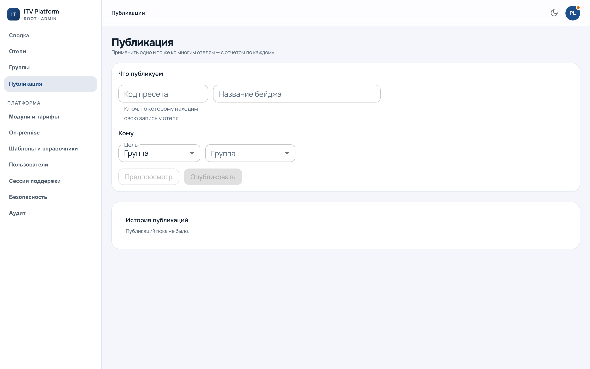

# Публикация

`/admin?section=publications` — применение одного и того же ко многим отелям:
бейдж, настройка, элемент справочника.

---

## Порядок: что, кому, предпросмотр, пуск

Экран ведёт по этому порядку, и **предпросмотр пропустить нельзя** — не потому,
что запрещено, а потому что он и есть та точка, где ошибку ещё видно.

Предпросмотр отвечает на два вопроса:

* **к скольким отелям применится** — и перечисляет несколько поимённо;
* **сколько отелей вне вашей области** — отдельным числом.

Второе не косметика. Оператор с областью видит «47», пускает, получает отчёт на
12 и идёт выяснять, что сломалось. Ничего не сломалось: остальные 35 ему просто
не принадлежат. Число «вне области» превращает этот разговор в строку на экране.

Считает предпросмотр **тем же кодом**, что и применение. Два разных подсчёта
давали бы «47» на экране и сорок восемь в отчёте, и объяснить это было бы нечем.

---

## Работа идёт фоном

Пуск не держит браузер: работа уходит в очередь, экран показывает ход. Окно
можно закрыть — публикация продолжится, и отчёт останется в истории.

Идёт **по одному отелю**, каждый в своей изоляции. Упавший отель не роняет
остальных: он получает свой исход и работа идёт дальше.

---

## Четыре исхода, и они не сводимы к «получилось / не получилось»

| Исход | Что значит | К кому идти |
|---|---|---|
| Применено | создано или обновлено | никуда |
| Пропущено | у отеля уже то же самое **либо своя правка** | см. ниже |
| Отказ | отель не принял: нет модуля, не тот тариф, лимит | к отелю |
| Ошибка | упало у нас | к нам |

**Отказ и ошибка считаются порознь** — это разные новости и разные адресаты.
Сводить их в «не применилось» значит терять ровно ту информацию, ради которой
отчёт и читают.

---

## Отель с локальной правкой

Самый частый вопрос, и ответ в нём сознательный.

Отель, переименовавший наш бейдж у себя, получает **пропуск**, а не
перезапись. Публикация **не спорит с человеком**: она сообщает платформе, что
здесь разошлись, и оставляет решение людям.

Такие отели показываются **отдельным списком** со ссылкой на
[расхождения](standards.md) — иначе «пропущено: 12» читается как «ничего не
произошло», хотя произошло важное: дюжина отелей живёт не по нашему образцу.

Вернуть отель к нашему виду можно, но только **явным действием** и по одному.
Массовой кнопки «перетереть всё» нет, и это не недоделка.

---

## Повтор ничего не ломает

Публикация идемпотентна по ключу источника: повторный запуск находит свою
строку и обновляет её, а не заводит вторую. Отель, у которого уже ровно то же
самое, получает **пропуск**, а не «применено» — считать это работой значило бы
отчитываться «применено 200» на пустом месте.

Значит, публикацию можно спокойно повторить, если непонятно, дошла ли она.

---

## История

Каждый запуск остаётся в истории с отчётом по каждому отелю. Это единственное
место, где видно **состав на момент запуска** — важно для групп-правил, состав
которых пересчитывается (см. [группы](groups.md)).

Права проверяются по весу действия: наблюдатель публикацию не запускает и
предпросмотр не открывает — смотреть, к скольким отелям применилось бы то,
чего он не может запустить, незачем.
