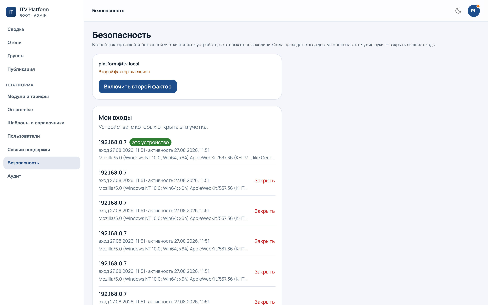
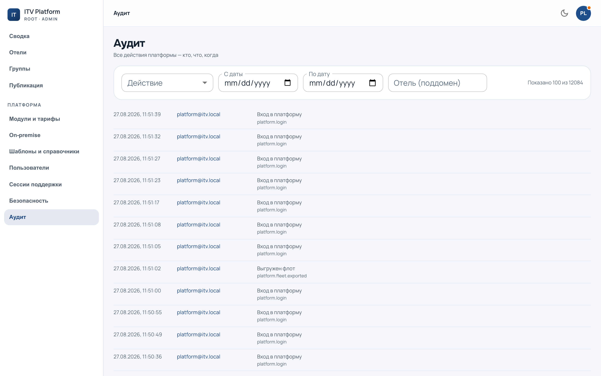

# Безопасность и журнал

Два раздела рядом: `/admin?section=security` — как нас пускают,
`/admin?section=audit` — что записано о том, что мы делали.

---

## Как нас пускают

**Второй фактор.** Включается на человеке; платформа может потребовать его от
всех сразу. Консоль — мастер-ключ ко всем отелям, и один утёкший пароль здесь
стоит дороже, чем где-либо ещё в системе.

**Список сетей.** Если у команды статические адреса, консоль можно закрыть до
них. Осторожно: **включённый список запирает всех, кто не в нём, включая вас.**
Сначала убедитесь, что ваш адрес в списке, и только потом включайте.

**Консоль недоступна с адресов отелей.** Это не настройка и выключить это
нельзя: попытка входа с поддомена отеля отвечает `platform_wrong_host`.

---

## Журнал

Журналов **два, и они разные**:

| Журнал | Что в нём | Кто видит |
|---|---|---|
| Платформы | входы, второй фактор, работа с командой, запуск публикаций | мы |
| Отеля | всё, что меняло данные отеля — включая наши действия | отель и мы |

Наши действия в отеле помечены как платформенные, с именем оператора. Отель их
видит и **удалить не может** — см. [вход под аудитом](support.md).

---

## Что журнал обязан содержать

Однажды он врал: часть действий из консоли записывалась так, будто их совершил
сотрудник отеля. Записи были, выглядели правдоподобно, и по ним нельзя было
понять, что в отеле работали мы.

Теперь автор действия — обязательное поле, а не то, что можно забыть проставить,
и проверка смотрит на **всё, что оператор написал за сессию**, а не на одну
показательную запись. Правило, которое из этого осталось:

> Журнал, в котором действие приписано не тому, кто его совершил, хуже
> отсутствующего журнала: отсутствие видно, а подмена — нет.

---

## Что здесь искать

Журнал платформы отвечает на вопросы «кто входил», «кто менял роль», «кто
запустил ту публикацию». Журнал отеля — на вопрос «кто изменил вот это»,
включая случаи, когда ответ «мы».

Фильтры по действию, периоду и человеку — на экране. Если у вас область, вы
видите записи только своих отелей.
