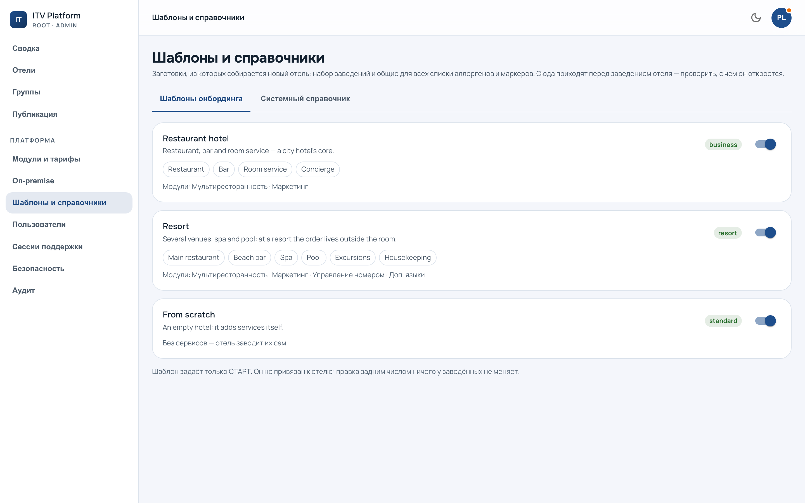

# Эталоны и расхождения

`/admin?section=templates` — наши образцы: шаблоны отеля и справочники, которые
получают все.

---

## Один механизм на всё

У эталона и копии отеля одно правило, и оно не меняется от того, что именно
наследуется:

> **Копия следует за эталоном, пока отель её не трогал. Тронутую эталон не
> перетирает никогда.**

Отсюда три состояния, и все три видны:

* копия совпадает с эталоном — следует за ним молча;
* отель правил копию — она **отвязывается** и живёт своей жизнью;
* отель удалил копию или завёл свою — тоже расхождение, просто другого рода.

Первым потребителем этого механизма стал системный справочник; дальше по тому
же правилу живут шаблоны. Единый механизм здесь не украшение: два похожих, но
разных правила наследования — это гарантированный вопрос «а почему тут иначе»,
на который нет хорошего ответа.

---

## Экран расхождений

Расхождения показываются списком: какой отель, что именно разошлось, в какую
сторону. Оттуда же — **возврат к эталону**, явным действием и по одному отелю.

Массовой кнопки «привести всех к образцу» нет. Расхождение почти всегда
означает, что отелю так нужно; узнать это можно только спросив, а не нажав.

Сюда же ведёт ссылка из отчёта [публикации](publication.md): отели, пропущенные
из-за локальной правки, перечисляются отдельно именно затем, чтобы «пропущено:
12» не осталось непрочитанным.

---

## Оформление — тот же механизм, другие слова

Тема отеля и пресет библиотеки — такая же пара, но читать её как «расхождение»
нельзя. Отель, перекрасивший витрину, не сломался: у него **своё оформление**.

Поэтому на экране оформления флота нет ни слова «расхождение», ни кнопки
«вернуть к эталону». Экран, предлагающий починить неполоманное, приучает
нажимать «ок» не глядя — и однажды этим «ок» снесут работу дизайнера отеля.

Что там есть — ответ на единственный вопрос, который у платформы к оформлению
действительно бывает:

> **Если мы поправим пресет, кого это коснётся?**

Коснётся только тех, кто за пресетом следует. Это число видно до правки, а не
после неё.

Три состояния: следует за пресетом · своё оформление · своя тема. Последнее —
не «неизвестно», а честное «источника нет»: происхождение темы записывается с
момента заведения отеля, и у тех, кто перекрасился раньше, оно утрачено
безвозвратно.

---

## Чего этот механизм не делает

**Не рассылает.** Эталон — источник, за которым следуют; он ничего не толкает в
отели сам. Рассылка — это [публикация](publication.md), отдельная операция с
отчётом и историей.

Это стоит сказать прямо, потому что документация однажды обещала обратное:
докстрока модели описывала распространение справочника, которого не
существовало ни в одном виде, и пережила это обещание на месяцы. Строка
исправлена; правило записано здесь.

**Не решает за отель.** Ни один сценарий не приводит к тихой перезаписи правки
отеля — ни публикация, ни смена эталона, ни возврат тарифа.
