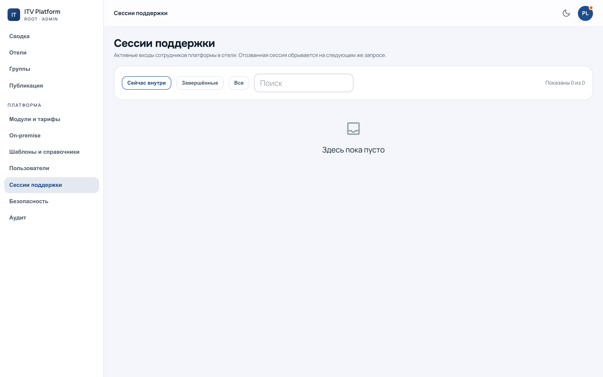

# Вход в отель под аудитом

`/admin?section=support` — наши входы в панели отелей: кто, куда, когда, ещё
идёт или закончился.

---

## Что это такое

Чтобы разобраться в проблеме отеля, надо увидеть то же, что видит отель.
Пересказ по телефону этого не заменяет. Поэтому мы входим в панель отеля под
учёткой его сотрудника — но так, чтобы это **нельзя было сделать незаметно**.

Три свойства, и все три обязательны:

* **Срок.** Сессия живёт ограниченное время и гаснет сама.
* **Отзыв.** Её можно прекратить досрочно — и с нашей стороны, и со стороны
  отеля.
* **Запись.** Вход попадает в **журнал отеля**, не только в наш.

Последнее — самое важное и сделано именно так, а не иначе: отель видит наше
присутствие у себя и **не может его скрыть или удалить**. Доступ, который
удобно не показывать клиенту, однажды не покажут.

---

## Как это выглядит у отеля

Всё, что мы делаем внутри, помечается в журнале отеля как **платформенное
действие** — с именем оператора. Не «система изменила настройку», а «такой-то
из платформы изменил настройку такого-то числа».

Отсюда правило работы: **входить под сотрудника отеля ради обычной настройки не
нужно.** Почти всё, что требуется, делается из консоли и остаётся нашим
действием. Вход под аудитом — для «покажите, что видите вы», а не для
экономии кликов.

---

## Что здесь видно

Список показывает открытые и закрытые сессии, срок и того, кто входил. Те же
записи по конкретному отелю — на вкладке «Поддержка» в его
[карточке](fleet.md#карточка-отеля): при разговоре с отелем удобнее смотреть
там.

Если область ограничена группами, вы видите здесь только свои отели — как и
везде (см. [область](team.md#область-режет-выдачу)).
