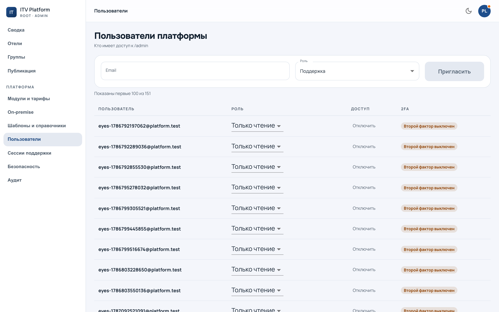

# Команда, роли и область

`/admin?section=team` — наши люди и то, что им доступно.

---

## Две оси, а не одна

Доступ описывается **двумя независимыми вопросами**, и путать их дорого.

**Роль — «что можно».** Их три: владелец (всё, включая команду, тарифы и
необратимое), поддержка (ведёт отели и входит в них, не трогает команду и
тариф), наблюдатель (смотрит).

**Область — «над кем».** Весь флот или перечисленные [группы](groups.md).

«Администратор сети» — это **не четвёртая роль**, а поддержка с областью из
одной группы. Заводить под него роль означало бы заводить новую роль под
каждую сеть.

---

## Область режет выдачу

Главное свойство, из-за которого область работает, а не только выглядит:

> **Отели вне области не видны в списках вовсе** — не «видны и недоступны».

Это касается всего: флота, поиска, групп, отчётов, узлов, журнала. Оператор
сети видит консоль так, будто других отелей не существует.

Следствие, к которому надо привыкнуть: **«у меня их нет» и «их нет вообще»
выглядят одинаково.** Поэтому там, где счёт важен — в массовых действиях и в
предпросмотре [публикации](publication.md), — рядом показывается число «вне
области», до нажатия.

---

## Владелец не ограничивается никогда

Владельцу область не назначается. Причина техническая, а не иерархическая:
платформа, умеющая ограничить всех своих владельцев, умеет **запереть сама
себя**, и починить это будет некому.

---

## Что видно на экране

У каждого человека видно роль, область и последний вход. Смена роли и области —
операция владельца; она пишется в [журнал платформы](security.md) вместе с тем,
кто её сделал.

Второй фактор включается здесь же и проверяется на входе, если он требуется
настройками платформы.

Дальше: [вход в отель под аудитом](support.md) — то, чем поддержка занимается
чаще всего.
